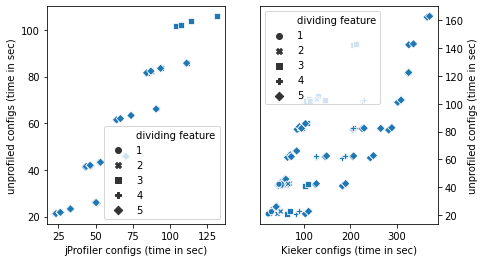

## Subject Systems

On this page we list the subject systems that we use to evaluate our approach. Each folder contains a submodule to the subject system's source repository and the feature model we used for sampling the configurations.

| System | Domain | LoC | &#124;F&#124; | &#124;C&#124; | &#124;CFW&#124; | &#124;CPW&#124; |
| :---      | :--- | ---: | ---: | ---: | ---: | ---: |
| Batik     | SVG rasterizer | 290,176 |  31 | 9.6&sdot;104| 28 | 337 |
| Catena    | Password hashing | 4,149 |   12 |  1.0&sdot;109| 875 | 2625 |
| cpd       | Copy-paste detector | 250,597 |     7 |  1.1&sdot;104| 40 | 115 |
| dc        | Image density converter | 6,633 |    24 |  3.4&sdot;106| 1600 | 9700 |
| H2        | Database | 297,623 |    16 | 6.5&sdot;1011| 375 | 2275 |
| Kanzi     | Data compression | 20,620 |  40 | 4.3&sdot;103| 34 | 458 |
| pmd       | Source-code analyzer | 304,048 |    11 |  5.1&sdot;102| 36 | 104 |
| Prevayler | Database | 10,400 |    12 |  1.3&sdot;105| 250 | 400 |
| Sunflow   | Rendering engine | 201,125 |     6 |  5.4&sdot;106| 125 | n/a |

### Profiled vs. Unprofiled
We identified different patter for the influence of the profiler on the subject systems.

#### Catena

#### CPD

#### Density-Converter

#### Prevayler

#### Sunflow

