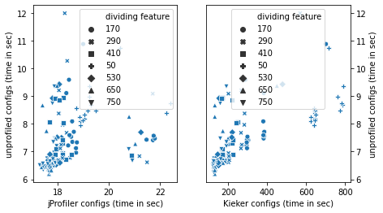
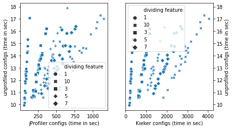

## Subject Systems

On this page we list the subject systems that we use to evaluate our approach. Each folder contains a submodule to the subject system's source repository and the feature model we used for sampling the configurations.

| System    | Domain | &#124;F&#124; | &#124;C&#124; | &#124;$CFW&#124; | &#124;$CPW&#124; |
| Batik     | SVG rasterizer | |  31 | $9.6$ | $\cdot$ | $10$  | $^{4}$ | 28 | 337 |
| Catena    | Password hashing | 3986 |   12 |  $1.0$ | $\cdot$ | $10$  | $^9$ | 875 | 2625 |
| cpd       | Copy-paste detector | |     7 |  $1.1$ | $\cdot$ | $10$  | $^4$ | 40 | 115 |
| dc        | Image density converter | |    24 |  $3.4$ | $\cdot$ | $10$  | $^6$ | 1600 | 9700 |
| H2        | Database | |    16 | $6.5$ | $\cdot$ | $10$  | $^{11}$ | 375 | 2275 |
| Kanzi     | Data compression | |  40 | $4.3$ | $\cdot$ | $10$  | $^{3}$ | 34 | 458 |
| pmd       | Source-code analyzer | |    11 |  $5.1$ | $\cdot$ | $10$  | $^2$ | 36 | 104 |
| Prevayler | Database | |    12 |  $1.3$ | $\cdot$ | $10$  | $^5$ | 250 | 400 |
| Sunflow   | Rendering engine | |     6 |  $5.4$ | $\cdot$ | $10$  | $^6$ | 125 | n/a |

### Feature Tracing
Here we show performance-relevant feature distributions at system-level and method-level.

### Profiled vs. Unprofiled
We identified different patter for the influence of the profiler on the subject systems.

#### Catena

#### CPD

#### Density-Converter

#### Prevayler

#### Sunflow

